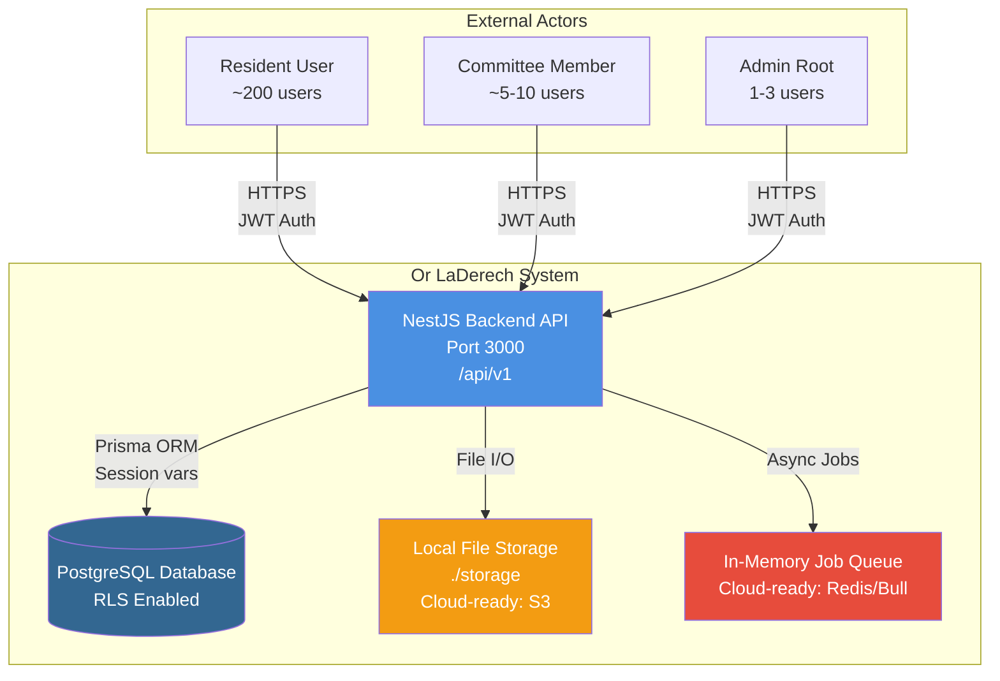
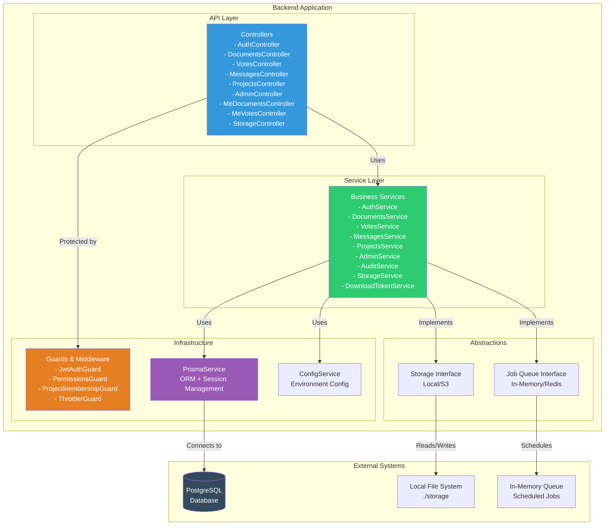
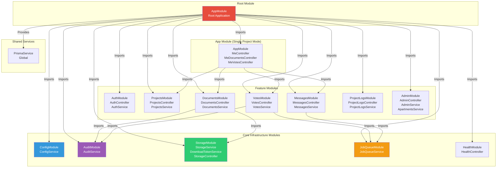
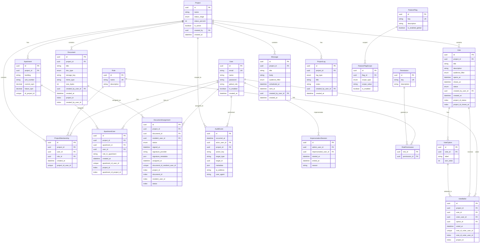
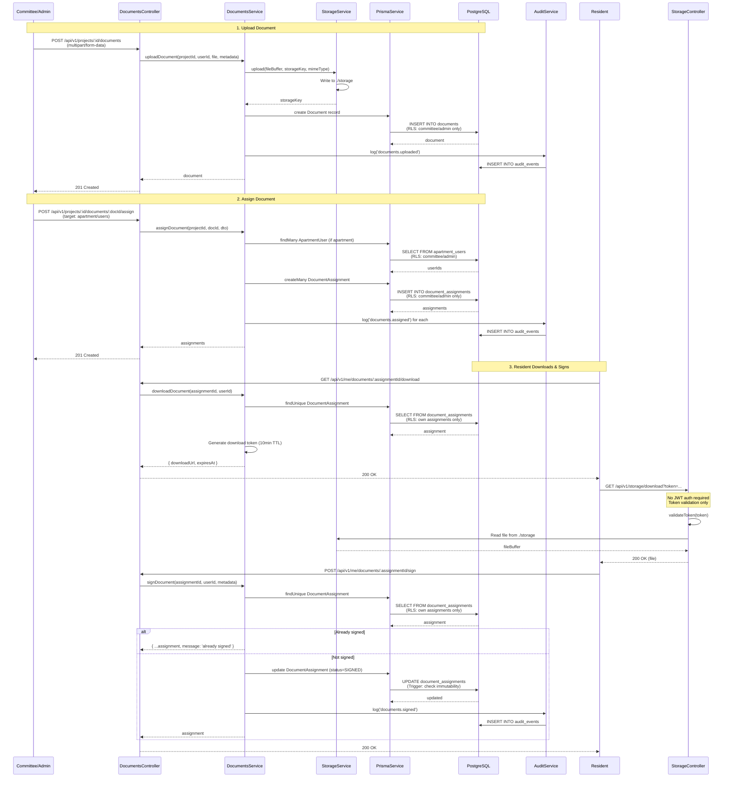
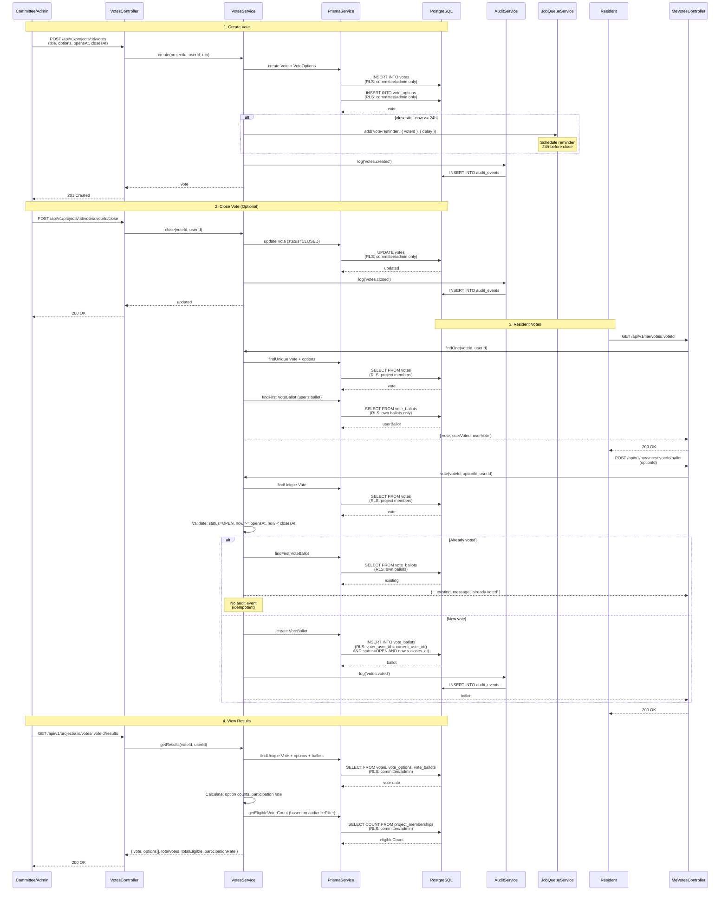
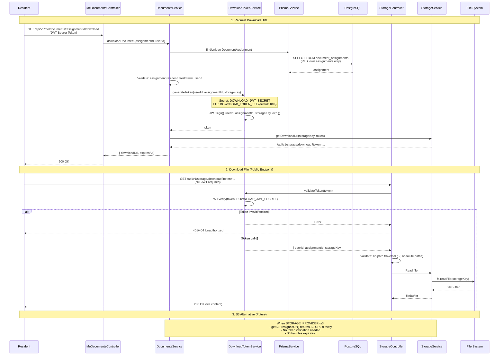

# Or LaDerech - Physical Architecture Diagram

**Version:** 1.0  
**Last Updated:** Based on current codebase state  
**Assumptions:** Single Project Mode (1 project, ~200 residents), Local Storage, In-Memory Job Queue

---

## Table of Contents

1. [System Context Diagram](#1-system-context-diagram)
2. [Backend Container Diagram](#2-backend-container-diagram)
3. [Backend Modules Diagram](#3-backend-modules-diagram-nestjs)
4. [Database Physical Schema](#4-database-physical-schema)
5. [Core Flows](#5-core-flows)
   - [Document Signing Flow](#51-document-signing-flow)
   - [Voting Flow](#52-voting-flow)
   - [Download Token Flow](#53-download-token-flow)

---

## 1. System Context Diagram

Shows the system and its external actors/interfaces.



**Explanation:**
- **External Actors:** Three user roles (Resident, Committee, Admin Root) interact with the system via HTTPS
- **NestJS Backend API:** Main application server on port 3000, exposes REST API at `/api/v1`
- **PostgreSQL Database:** Primary data store with Row Level Security (RLS) enabled for multi-tenant isolation
- **Local File Storage:** Currently local filesystem (`./storage`), designed to be S3-ready
- **In-Memory Job Queue:** Currently in-memory, designed to be Redis/Bull-ready for scheduled tasks

**Assumptions:**
- Single Project Mode: One project with ~200 residents
- Local deployment (not cloud yet, but cloud-ready abstractions in place)
- JWT-based authentication for all API access

---

## 2. Backend Container Diagram

Shows the main containers/components within the backend system.



**Explanation:**
- **API Layer:** REST controllers handle HTTP requests, route to appropriate services
- **Service Layer:** Business logic, data access, orchestration
- **Infrastructure:** Guards enforce RBAC and multi-tenant isolation, Prisma handles DB access with session vars for RLS
- **Abstractions:** Cloud-ready interfaces allow switching between local/S3 storage and in-memory/Redis job queues
- **External Systems:** PostgreSQL (with RLS), local filesystem, in-memory job queue

**Security Boundaries:**
- **JWT Auth:** All API endpoints (except `/storage/download`) require JWT token
- **RBAC:** PermissionsGuard enforces role-based access control
- **Multi-tenant:** ProjectMembershipGuard ensures project isolation
- **RLS:** Database-level policies enforce tenant isolation

---

## 3. Backend Modules Diagram (NestJS)

Shows NestJS module dependencies and structure.



**Explanation:**
- **Root Module (AppModule):** Orchestrates all feature modules and provides global services (PrismaService, ThrottlerGuard)
- **Core Infrastructure:** Config, Audit, Storage, JobQueue, Health - used across all features
- **Feature Modules:** Domain-specific modules (Auth, Projects, Documents, Votes, Messages, etc.)
- **App Module:** Special module for Single Project Mode endpoints (`/api/v1/me/*`)
- **Dependencies:** DocumentsModule depends on StorageModule and AuditModule; VotesModule depends on AuditModule and JobQueueModule

**Module Boundaries:**
- Each module encapsulates its domain logic
- Global modules (StorageModule, JobQueueModule) are marked with `@Global()` decorator
- PrismaService is provided at root level for all modules

---

## 4. Database Physical Schema

Shows the physical database tables, relationships, and key constraints.



**Explanation:**
- **Core Entities:** User, Role, Permission, Project - foundation of RBAC and multi-tenant model
- **Resident Domain:** Apartment, ApartmentUser (max 2 users per apartment, enforced by trigger)
- **Documents:** Document, DocumentAssignment (immutable once signed, enforced by trigger)
- **Voting:** Vote, VoteOption, VoteBallot (one vote per user, enforced by unique constraint)
- **Messaging:** Message (scheduled messages with audience filters)
- **Audit & Security:** AuditEvent (all critical actions), ImpersonationSession (admin impersonation)

**Key Constraints:**
- **Multi-tenant:** All tables have `project_id` FK (except User, Role, Permission)
- **RLS:** Row Level Security enabled on all tenant-scoped tables
- **Triggers:** 
  - `check_apartment_user_limit()` - Max 2 users per apartment
  - `check_document_assignment_immutable()` - Signed documents immutable
- **Unique Constraints:**
  - `(project_id, user_id)` on ProjectMembership
  - `(apartment_id, user_id)` on ApartmentUser
  - `(document_id, resident_user_id)` on DocumentAssignment
  - `(vote_id, voter_user_id)` on VoteBallot

---

## 5. Core Flows

### 5.1 Document Signing Flow

Shows the complete flow from document upload to resident signing.



**Explanation:**
1. **Upload:** Committee uploads document, stored in local filesystem, metadata saved to DB
2. **Assign:** Document assigned to residents (via apartment or direct user list), creates DocumentAssignment records
3. **Download:** Resident requests download URL, receives tokenized URL (10min TTL), downloads via public endpoint (no JWT required)
4. **Sign:** Resident signs document, status updated to SIGNED, trigger prevents future modifications, audit event logged

**Security Boundaries:**
- **RLS:** Database enforces tenant isolation and role-based access
- **Trigger:** `check_document_assignment_immutable()` prevents modification of signed assignments
- **Token:** Download token uses separate secret (`DOWNLOAD_JWT_SECRET`), short TTL (10min)

---

### 5.2 Voting Flow

Shows the complete flow from vote creation to ballot submission and results.



**Explanation:**
1. **Create Vote:** Committee creates vote with options and time window, reminder job scheduled if enough time remains
2. **Close Vote:** Committee can manually close vote (optional, can also auto-close at closesAt)
3. **Resident Votes:** Resident views vote, submits ballot (idempotent - returns existing if already voted, no duplicate audit)
4. **View Results:** Committee views aggregated results with participation statistics

**Security Boundaries:**
- **RLS:** Database enforces tenant isolation, residents see only own ballots
- **Time Validation:** Service and RLS enforce `now >= opensAt AND now < closesAt`
- **Unique Constraint:** `(vote_id, voter_user_id)` prevents double voting at DB level
- **Idempotency:** Service returns existing ballot without duplicate audit event

---

### 5.3 Download Token Flow

Shows the secure token-based file download flow for local storage.



**Explanation:**
1. **Request Download URL:** Resident requests download URL, system generates short-lived JWT token (10min TTL) with separate secret
2. **Download File:** Resident uses token to download via public endpoint (no JWT auth required), token validated, path traversal prevented, file served
3. **S3 Alternative:** When using S3, presigned URLs returned directly (no token validation on download path)

**Security Boundaries:**
- **JWT Auth:** Initial request requires JWT token (resident authentication)
- **Download Token:** Separate secret (`DOWNLOAD_JWT_SECRET`), short TTL (10min default)
- **Public Endpoint:** `/storage/download` does NOT require JWT - relies on token validation only
- **Path Traversal:** Service validates storageKey to prevent directory traversal attacks
- **RLS:** Database ensures resident can only access their own assignments

**Token Payload:**
```typescript
{
  userId: string,
  assignmentId: string,
  storageKey: string,
  exp: number // Unix timestamp
}
```

---

## Assumptions & Constraints

### Current Deployment
- **Single Project Mode:** One project with ~200 residents
- **Local Storage:** Files stored in `./storage` directory
- **In-Memory Jobs:** Job queue runs in-memory (no Redis)
- **Local Database:** PostgreSQL running locally (not RDS yet)

### Cloud-Ready Abstractions
- **Storage Interface:** Can switch to S3 by changing `STORAGE_PROVIDER` env var
- **Job Queue Interface:** Can switch to Redis/Bull by changing `JOB_QUEUE_PROVIDER` env var
- **Multi-tenant Ready:** Database schema and RLS support multiple projects (currently using one)

### Security Model
- **JWT Authentication:** All API endpoints (except `/storage/download`) require JWT
- **RBAC:** Permissions enforced at guard level and database RLS
- **Multi-tenant Isolation:** `project_id` enforced at service, guard, and RLS levels
- **Download Tokens:** Separate secret, short TTL, no JWT required for download endpoint

### Database Constraints
- **RLS Enabled:** All tenant-scoped tables have Row Level Security policies
- **Triggers:** 
  - Max 2 users per apartment
  - Signed document assignments immutable
- **Unique Constraints:** Prevent duplicate votes, assignments, memberships

---

## Future Enhancements

1. **S3 Storage:** Implement `getS3PresignedUrl()` in StorageService
2. **Redis Job Queue:** Implement Redis/Bull job queue provider
3. **Multi-Project:** Enable multiple projects (currently Single Project Mode)
4. **UNSIGNED_RESIDENTS Filter:** Implement proper filtering based on signed document assignments
5. **Reminder Jobs:** Implement actual email/push notification sending in `sendVoteReminder()`

---

**Document Version:** 1.0  
**Last Updated:** Based on current codebase state  
**Maintained By:** Development Team
