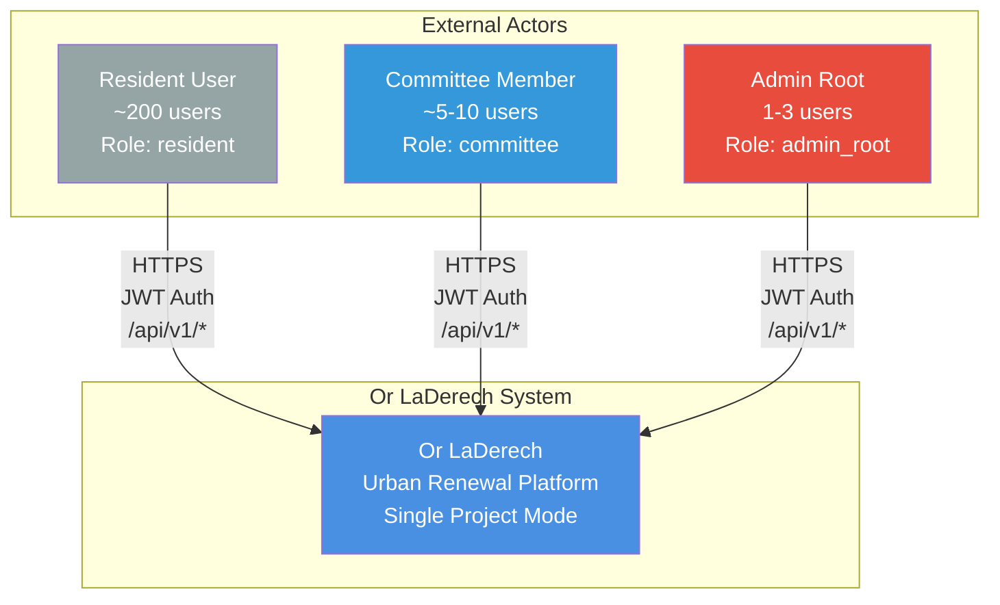
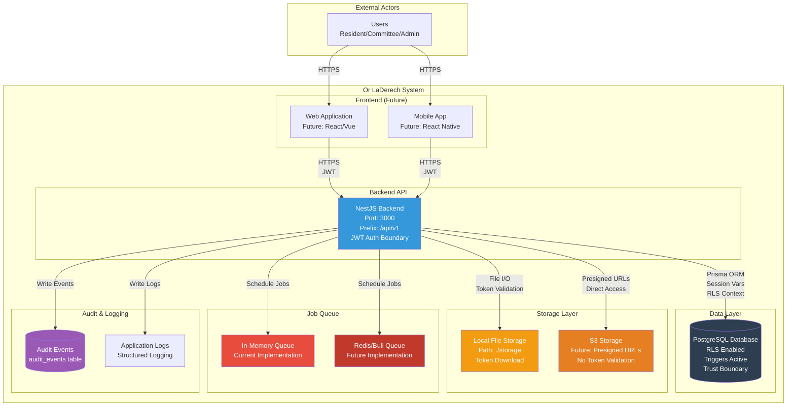
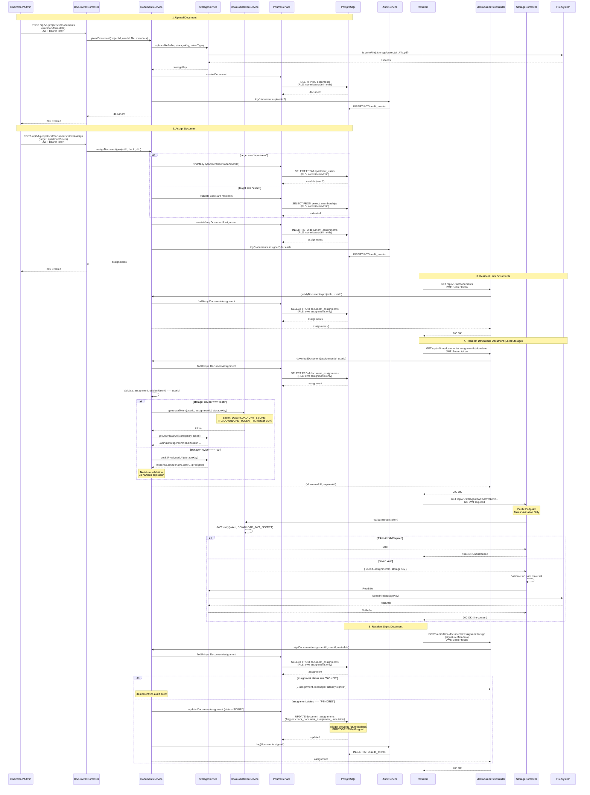
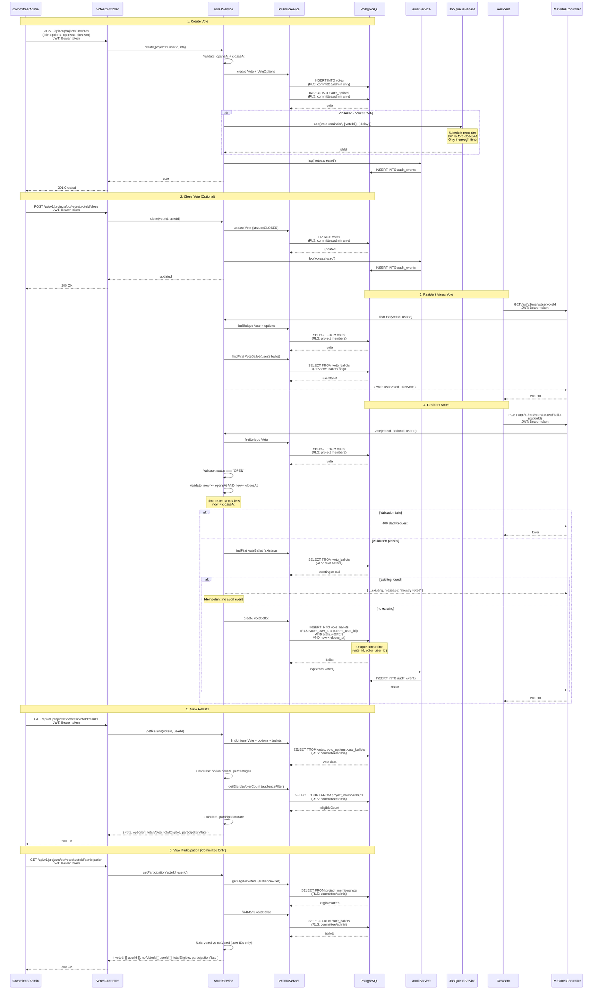
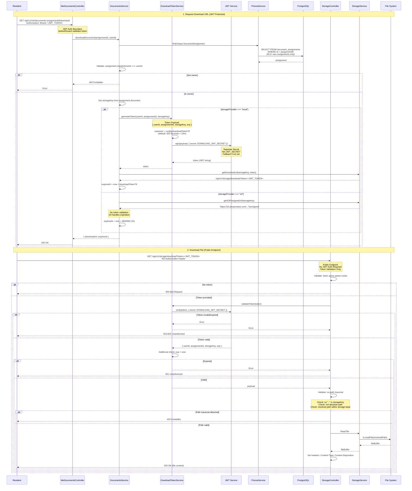

# Or LaDerech - Physical Architecture Diagram Pack

**Version:** 1.0  
**Last Updated:** Based on current codebase state  
**Format:** Mermaid diagrams

---

## Table of Contents

1. [C4 Level 1 - System Context](#1-c4-level-1---system-context)
2. [C4 Level 2 - Containers](#2-c4-level-2---containers)
3. [C4 Level 3 - Backend Components](#3-c4-level-3---backend-components)
4. [Database Physical ERD](#4-database-physical-erd)
5. [Sequence Diagrams](#5-sequence-diagrams)
   - [Document Flow](#51-document-flow)
   - [Voting Flow](#52-voting-flow)
   - [Download Token Validation Flow](#53-download-token-validation-flow)

---

## 1. C4 Level 1 - System Context

Shows the system and its external actors.



**Explanation:**
- **External Actors:** Three user roles interact with the system via HTTPS
- **System:** Single unified platform for urban renewal project management
- **Authentication:** All API access requires JWT Bearer token (except public download endpoint)
- **API Versioning:** All endpoints prefixed with `/api/v1`

**Assumptions:**
- Single Project Mode: One project with ~200 residents
- Local deployment (cloud-ready but running locally)
- JWT-based authentication for all protected endpoints

---

## 2. C4 Level 2 - Containers

Shows the main containers/components within the system.



**Explanation:**
- **Frontend:** Web and Mobile applications (future implementations)
- **Backend API:** NestJS application with JWT authentication boundary
- **PostgreSQL:** Database with Row Level Security (RLS) and triggers for business rules
- **Storage:** Local filesystem (current) and S3 (future), different access patterns
- **Job Queue:** In-memory (current) and Redis/Bull (future) for scheduled tasks
- **Audit:** Database table for audit events, structured logging for application logs

**Security Boundaries:**
- **JWT Auth Boundary:** All API endpoints (except `/api/v1/storage/download`) require JWT
- **RLS Boundary:** Database enforces tenant isolation via Row Level Security policies
- **Trigger Boundary:** Database triggers enforce business rules (max 2 users, immutability)
- **Public Download Boundary:** `/api/v1/storage/download` is public, relies on token validation only

**Assumptions:**
- Frontend not yet implemented (API-first approach)
- Local storage currently, S3 ready via abstraction
- In-memory jobs currently, Redis/Bull ready via abstraction

---

## 3. C4 Level 3 - Backend Components

Shows the physical NestJS modules and their key components.

```mermaid
graph TB
    subgraph "Root Module"
        AppModule[AppModule<br/>Root Application<br/>Provides: PrismaService<br/>Global: ThrottlerGuard]
    end

    subgraph "Core Infrastructure"
        ConfigModule[ConfigModule<br/>ConfigService<br/>Environment Variables]
        AuditModule[AuditModule<br/>AuditService<br/>Logs critical actions]
        StorageModule[StorageModule<br/>@Global<br/>StorageService<br/>DownloadTokenService<br/>StorageController]
        JobQueueModule[JobQueueModule<br/>@Global<br/>JobQueueService<br/>InMemory/Redis abstraction]
        HealthModule[HealthModule<br/>HealthController<br/>/health endpoints]
    end

    subgraph "Authentication & Authorization"
        AuthModule[AuthModule<br/>AuthController<br/>AuthService<br/>Routes: /api/v1/auth/*]
        Guards[Guards & Middleware<br/>JwtAuthGuard<br/>PermissionsGuard<br/>ProjectMembershipGuard]
    end

    subgraph "Feature Modules"
        ProjectsModule[ProjectsModule<br/>ProjectsController<br/>ProjectsService<br/>Routes: /api/v1/projects/*]
        DocumentsModule[DocumentsModule<br/>DocumentsController<br/>DocumentsService<br/>Routes: /api/v1/projects/:id/documents/*]
        VotesModule[VotesModule<br/>VotesController<br/>VotesService<br/>Routes: /api/v1/projects/:id/votes/*]
        MessagesModule[MessagesModule<br/>MessagesController<br/>MessagesService<br/>Routes: /api/v1/projects/:id/messages/*]
        ProjectLogsModule[ProjectLogsModule<br/>ProjectLogsController<br/>ProjectLogsService<br/>Routes: /api/v1/projects/:id/logs/*]
        AdminModule[AdminModule<br/>AdminController<br/>AdminService<br/>ApartmentsService<br/>Routes: /api/v1/admin/*]
    end

    subgraph "Single Project Mode Module"
        AppMeModule[AppModule<br/>app/app.module.ts<br/>MeController<br/>MeDocumentsController<br/>MeVotesController<br/>Routes: /api/v1/me/*]
    end

    AppModule -->|Imports| ConfigModule
    AppModule -->|Imports| AuditModule
    AppModule -->|Imports| StorageModule
    AppModule -->|Imports| JobQueueModule
    AppModule -->|Imports| HealthModule
    AppModule -->|Imports| AuthModule
    AppModule -->|Imports| ProjectsModule
    AppModule -->|Imports| DocumentsModule
    AppModule -->|Imports| VotesModule
    AppModule -->|Imports| MessagesModule
    AppModule -->|Imports| ProjectLogsModule
    AppModule -->|Imports| AdminModule
    AppModule -->|Imports| AppMeModule

    DocumentsModule -->|Uses| StorageModule
    DocumentsModule -->|Uses| AuditModule
    VotesModule -->|Uses| AuditModule
    VotesModule -->|Uses| JobQueueModule
    MessagesModule -->|Uses| JobQueueModule
    AppMeModule -->|Uses| DocumentsModule
    AppMeModule -->|Uses| VotesModule
    AppMeModule -->|Uses| MessagesModule
    AppMeModule -->|Uses| ProjectsModule

    AuthModule -->|Provides| Guards
    AllModules[All Modules] -->|Uses| Guards

    style AppModule fill:#e74c3c,color:#fff
    style ConfigModule fill:#3498db,color:#fff
    style StorageModule fill:#2ecc71,color:#fff
    style JobQueueModule fill:#f39c12,color:#fff
    style AuditModule fill:#9b59b6,color:#fff
    style AuthModule fill:#e67e22,color:#fff
    style AppMeModule fill:#16a085,color:#fff
```

**Explanation:**
- **Root Module:** AppModule orchestrates all modules, provides PrismaService globally
- **Core Infrastructure:** Config, Audit, Storage, JobQueue, Health - shared across features
- **Authentication:** AuthModule handles login/register, Guards enforce RBAC
- **Feature Modules:** Domain-specific modules with controllers and services
- **Single Project Mode:** AppMeModule provides `/api/v1/me/*` endpoints for residents

**Key Controllers:**
- **DocumentsController:** `/api/v1/projects/:projectId/documents/*` (upload, assign, summary)
- **MeDocumentsController:** `/api/v1/me/documents/*` (list, download, sign)
- **VotesController:** `/api/v1/projects/:projectId/votes/*` (create, close, results, participation)
- **MeVotesController:** `/api/v1/me/votes/*` (list, vote, details)
- **StorageController:** `/api/v1/storage/download` (public, token-validated)

**Module Dependencies:**
- DocumentsModule depends on StorageModule (file operations) and AuditModule (audit logging)
- VotesModule depends on AuditModule and JobQueueModule (reminder scheduling)
- AppMeModule depends on DocumentsModule, VotesModule, MessagesModule, ProjectsModule

---

## 4. Database Physical ERD

Shows physical database schema with tables, relationships, and constraints.

```mermaid
erDiagram
    User ||--o{ ProjectMembership : "member_of"
    User ||--o{ ApartmentUser : "lives_in"
    User ||--o{ DocumentAssignment : "assigned_to"
    User ||--o{ VoteBallot : "voted"
    User ||--o{ AuditEvent : "performed"
    User ||--o{ ImpersonationSession : "impersonates"

    Role ||--o{ ProjectMembership : "assigned"
    Role ||--o{ RolePermission : "has"
    Permission ||--o{ RolePermission : "granted_to"

    Project ||--o{ ProjectMembership : "contains"
    Project ||--o{ Apartment : "has"
    Project ||--o{ Document : "contains"
    Project ||--o{ Vote : "contains"
    Project ||--o{ Message : "contains"
    Project ||--o{ ProjectLog : "has"
    Project ||--o{ AuditEvent : "scoped_to"

    Apartment ||--o{ ApartmentUser : "occupied_by"
    Document ||--o{ DocumentAssignment : "assigned_as"
    Vote ||--o{ VoteOption : "has"
    Vote ||--o{ VoteBallot : "receives"
    VoteOption ||--o{ VoteBallot : "selected_in"

    FeatureFlag ||--o{ FeatureFlagScope : "scoped"

    User {
        uuid id PK "RLS: N/A"
        string email UK
        string name
        string password
        string global_role
        boolean is_enabled
        datetime created_at
    }

    Role {
        uuid id PK "RLS: N/A"
        string name UK
        string description
    }

    Permission {
        uuid id PK "RLS: N/A"
        string key UK
        string description
    }

    RolePermission {
        uuid role_id PK "RLS: N/A"
        uuid permission_id PK
    }

    Project {
        uuid id PK "RLS: Enabled"
        string name
        enum status_stage
        int status_percent
        boolean is_active
        uuid created_by FK
        datetime created_at
    }

    ProjectMembership {
        uuid id PK "RLS: Enabled"
        uuid project_id FK "Tenant Boundary"
        uuid user_id FK
        uuid role_id FK
        datetime created_at
        unique project_id_user_id
    }

    Apartment {
        uuid id PK "RLS: Enabled"
        uuid project_id FK "Tenant Boundary"
        string building
        string unit_number
        decimal current_sqm
        decimal future_sqm
        unique id_project_id "Composite Unique"
    }

    ApartmentUser {
        uuid id PK "RLS: Enabled"
        uuid project_id FK "Tenant Boundary"
        uuid apartment_id FK "Composite FK: apartment_id + project_id"
        uuid user_id FK
        string role_in_apartment
        datetime created_at
        unique apartment_id_user_id
        index project_id
        index apartment_id_project_id "Composite Index"
        trigger max_2_users "check_apartment_user_limit()"
    }

    Document {
        uuid id PK "RLS: Enabled"
        uuid project_id FK "Tenant Boundary"
        string title
        enum doc_type
        string storage_key
        string mime_type
        int size_bytes
        uuid created_by_user_id FK
        datetime created_at
        index project_id
        index created_by_user_id
    }

    DocumentAssignment {
        uuid id PK "RLS: Enabled"
        uuid project_id FK "Tenant Boundary"
        uuid document_id FK
        uuid resident_user_id FK
        enum status "PENDING|SIGNED"
        datetime signed_at
        string signature_provider
        json signature_metadata
        datetime assigned_at
        unique document_id_resident_user_id
        index project_id
        index document_id
        index resident_user_id
        index status
        trigger immutable_signed "check_document_assignment_immutable()"
    }

    Vote {
        uuid id PK "RLS: Enabled"
        uuid project_id FK "Tenant Boundary"
        string title
        string description
        enum audience_filter
        datetime opens_at
        datetime closes_at "Time Rule: now < closes_at"
        enum status "DRAFT|OPEN|CLOSED"
        uuid created_by_user_id FK
        datetime created_at
        index project_id_status
        index project_id_closes_at
    }

    VoteOption {
        uuid id PK "RLS: Enabled"
        uuid vote_id FK
        string label
        int sort_order
    }

    VoteBallot {
        uuid id PK "RLS: Enabled"
        uuid project_id FK "Tenant Boundary"
        uuid vote_id FK
        uuid voter_user_id FK
        uuid option_id FK
        datetime voted_at
        unique vote_id_voter_user_id "One vote per user"
        index vote_id_voter_user_id
        index project_id
    }

    Message {
        uuid id PK "RLS: Enabled"
        uuid project_id FK "Tenant Boundary"
        string title
        string body
        enum audience_filter
        datetime scheduled_at
        datetime sent_at
        uuid created_by_user_id FK
        datetime created_at
    }

    ProjectLog {
        uuid id PK "RLS: Enabled"
        uuid project_id FK "Tenant Boundary"
        enum log_type
        string title
        string notes
        uuid created_by_user_id FK
        datetime created_at
    }

    AuditEvent {
        uuid id PK "RLS: Enabled"
        datetime occurred_at
        uuid actor_user_id FK
        uuid project_id FK "Tenant Boundary"
        string action_key
        string target_type
        uuid target_id
        json metadata
        string ip_address
        string user_agent
    }

    ImpersonationSession {
        uuid id PK "RLS: Enabled"
        uuid admin_user_id FK
        uuid impersonated_user_id FK
        datetime started_at
        datetime ended_at
        string reason
    }

    FeatureFlag {
        uuid id PK "RLS: N/A"
        string key UK
        string description
        boolean is_enabled_global
    }

    FeatureFlagScope {
        uuid id PK "RLS: N/A"
        uuid flag_id FK
        enum scope_type
        string scope_value
        boolean is_enabled
    }
```



**Explanation:**
- **RLS Enabled:** All tenant-scoped tables have Row Level Security policies (except User, Role, Permission, FeatureFlag)
- **Tenant Boundary:** `project_id` foreign key on all tenant-scoped tables
- **Composite FK:** `ApartmentUser.apartment_id` references `Apartment(id, project_id)` composite unique
- **Triggers:**
  - `check_apartment_user_limit()`: Enforces max 2 users per apartment (ERRCODE 23514)
  - `check_document_assignment_immutable()`: Prevents modification of signed assignments (ERRCODE 23514)
- **Time Rule:** Vote time validation: `now >= opensAt AND now < closesAt` (strictly less)
- **Unique Constraints:**
  - `(project_id, user_id)` on ProjectMembership
  - `(apartment_id, user_id)` on ApartmentUser
  - `(document_id, resident_user_id)` on DocumentAssignment
  - `(vote_id, voter_user_id)` on VoteBallot (one vote per user)

**Key Indexes:**
- `apartment_users(apartment_id, project_id)` - Composite index for FK lookup
- `votes(project_id, status)` - Filter open/closed votes
- `votes(project_id, closes_at)` - Time-based queries
- `document_assignments(status)` - Filter pending/signed

---

## 5. Sequence Diagrams

### 5.1 Document Flow

Complete flow from upload to download and signing.



**Explanation:**
1. **Upload:** Committee uploads document, stored in local filesystem or S3, metadata saved to DB
2. **Assign:** Document assigned to residents (via apartment or direct users), creates DocumentAssignment records
3. **List:** Resident lists their assigned documents (RLS ensures only own assignments)
4. **Download:** 
   - **Local:** Token generated (10min TTL, separate secret), public endpoint validates token
   - **S3:** Presigned URL returned directly (no token validation)
5. **Sign:** Resident signs document, trigger prevents future modifications, audit event logged (idempotent)

**Security Boundaries:**
- **JWT Auth:** All endpoints except `/api/v1/storage/download` require JWT
- **RLS:** Database enforces tenant isolation and role-based access
- **Trigger:** `check_document_assignment_immutable()` prevents modification of signed assignments
- **Token:** Download token uses `DOWNLOAD_JWT_SECRET`, TTL configurable (default 10m)

---

### 5.2 Voting Flow

Complete flow from vote creation to results.



**Explanation:**
1. **Create Vote:** Committee creates vote with options and time window, reminder scheduled if enough time (>=24h)
2. **Close Vote:** Committee can manually close vote (optional, can auto-close at closesAt)
3. **View Vote:** Resident views vote details and their ballot status
4. **Vote:** Resident submits ballot, time validation (`now >= opensAt AND now < closesAt`), idempotent (no duplicate audit)
5. **Results:** Committee views aggregated results with participation statistics
6. **Participation:** Committee views voted/not voted lists (user IDs only, per spec)

**Security Boundaries:**
- **JWT Auth:** All endpoints require JWT
- **RLS:** Database enforces tenant isolation, residents see only own ballots
- **Time Validation:** Service and RLS enforce `now >= opensAt AND now < closesAt` (strictly less)
- **Unique Constraint:** `(vote_id, voter_user_id)` prevents double voting at DB level
- **Idempotency:** Service returns existing ballot without duplicate audit event

---

### 5.3 Download Token Validation Flow

Detailed flow of token generation and validation for file downloads.



**Explanation:**
1. **Request Download URL:** Resident requests download URL with JWT auth, system generates short-lived token (10min TTL, separate secret)
2. **Download File:** Resident uses token to download via public endpoint (no JWT required), token validated, path traversal prevented, file served

**Security Boundaries:**
- **JWT Auth Boundary:** Initial request requires JWT token (resident authentication)
- **Public Download Boundary:** `/api/v1/storage/download` does NOT require JWT - relies on token validation only
- **Token Secret:** Separate secret (`DOWNLOAD_JWT_SECRET`), falls back to `JWT_SECRET` if not set
- **Token TTL:** Configurable via `DOWNLOAD_TOKEN_TTL` (default: 10 minutes = 600 seconds)
- **Path Traversal Protection:** Service validates storageKey to prevent directory traversal attacks
- **RLS:** Database ensures resident can only access their own assignments

**Token Payload Structure:**
```typescript
{
  userId: string,        // Resident user ID
  assignmentId: string, // Document assignment ID
  storageKey: string,   // File storage key/path
  exp: number           // Unix timestamp expiration
}
```

**S3 Alternative:**
- When `STORAGE_PROVIDER=s3`, presigned URLs returned directly
- No token validation needed on download path
- S3 handles URL expiration (typically 1 hour)

---

## Assumptions & Constraints

### Current Deployment
- **Single Project Mode:** One project with ~200 residents (multi-project ready)
- **Local Storage:** Files stored in `./storage` directory (S3-ready via abstraction)
- **In-Memory Jobs:** Job queue runs in-memory (Redis/Bull-ready via abstraction)
- **Local Database:** PostgreSQL running locally (RLS enabled, triggers active)

### Security Model
- **JWT Authentication:** All API endpoints (except `/api/v1/storage/download`) require JWT Bearer token
- **RBAC:** Permissions enforced at guard level (`PermissionsGuard`) and database RLS
- **Multi-tenant Isolation:** `project_id` enforced at service, guard (`ProjectMembershipGuard`), and RLS levels
- **Download Tokens:** Separate secret (`DOWNLOAD_JWT_SECRET`), short TTL (10min default), no JWT required for download endpoint

### Database Constraints
- **RLS Enabled:** All tenant-scoped tables have Row Level Security policies
- **Triggers:**
  - `check_apartment_user_limit()`: Max 2 users per apartment (ERRCODE 23514)
  - `check_document_assignment_immutable()`: Signed documents immutable (ERRCODE 23514)
- **Unique Constraints:** Prevent duplicate votes, assignments, memberships
- **Composite FK:** `ApartmentUser.apartment_id` references `Apartment(id, project_id)` composite unique

### Time Rules
- **Vote Time Validation:** `now >= opensAt AND now < closesAt` (strictly less than)
- **Reminder Scheduling:** Only if `closesAt - now >= 24h`, and `delay > 0` (not in past)

### API Routes
- **Prefix:** All routes use `/api/v1` prefix
- **Project-scoped:** `/api/v1/projects/:projectId/*` (committee/admin)
- **Single Project Mode:** `/api/v1/me/*` (residents, auto-resolves project)
- **Public:** `/api/v1/storage/download?token=...` (no JWT required)

---

**Document Version:** 1.0  
**Last Updated:** Based on current codebase state  
**Maintained By:** Development Team
